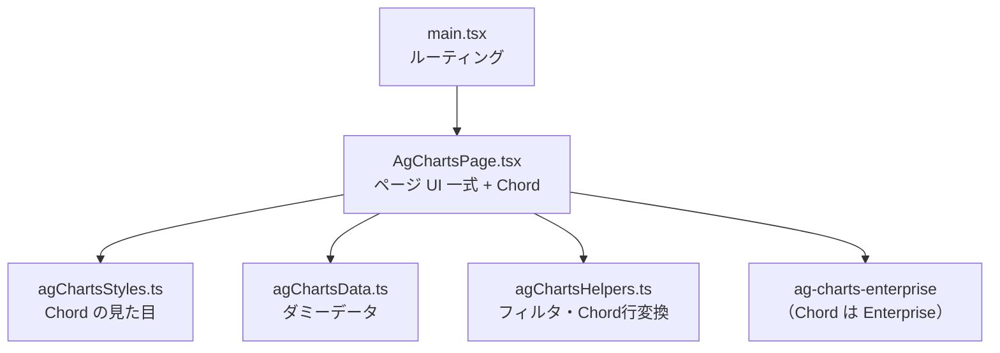
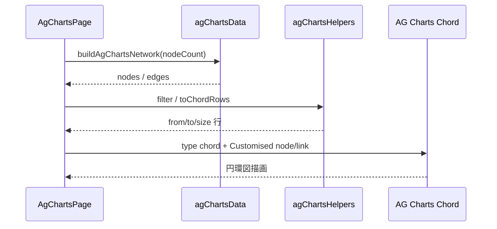

# コンポーネント構成図 — AG Charts Chord

提案用。実装フォルダ: [`src/transitionNetworkAgCharts/`](../src/transitionNetworkAgCharts/)（4 files）

- ルート: `/transition-network/agcharts`
- 全体方針・画面レイアウト: [transition-network.md](./transition-network.md)
- 他実装: [スクラッチ](./component-scratch.md) / [Cytoscape](./component-cytoscape.md) / [GoJS](./component-gojs.md)

## 全体構成

## データ・描画の流れ

## ファイル一覧

| ファイル | 役割 |
| --- | --- |
| `AgChartsPage.tsx` | ページ全体（ナビ、4領域 UI、Chord 描画） |
| `agChartsStyles.ts` | Customised Chord（node / link / label 色） |
| `agChartsData.ts` | カテゴリ／遷移のダミーデータ（最大30・圏外なし） |
| `agChartsHelpers.ts` | しきい値フィルタ・Chord 行への変換 |

## 特徴（提案メモ）

- **1枚の Chord** で最大30カテゴリ間の流出入を表現（楕円ノード配置ではない）
- **圏外は非表示**（カテゴリ間遷移のみ）
- 見た目の太さは均等（`size: 1`）。実件数はホバー時ツールチップに表示
- Chord Series は **AG Charts Enterprise**（評価時はウォーターマークが出ることがある）
