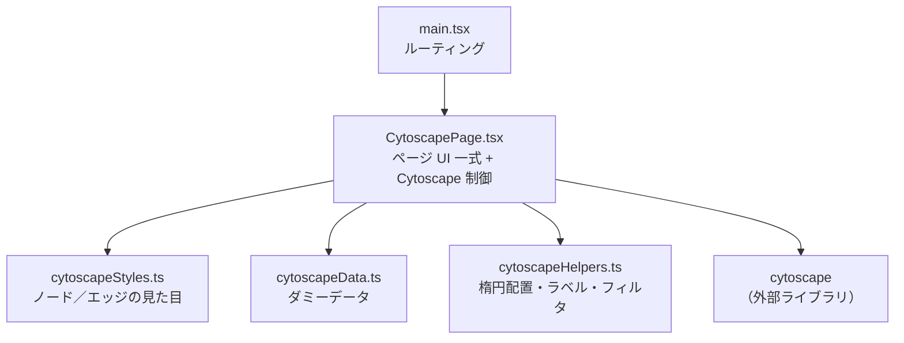
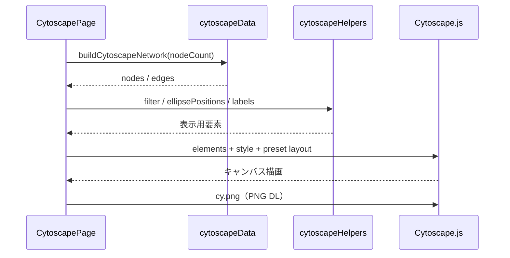

# コンポーネント構成図 — Cytoscape.js

提案用。実装フォルダ: [`src/transitionNetworkCytoscape/`](../src/transitionNetworkCytoscape/)（4 files）

- ルート: `/transition-network/cytoscape`
- 全体方針・画面レイアウト: [transition-network.md](./transition-network.md)
- 他実装: [スクラッチ](./component-scratch.md) / [GoJS](./component-gojs.md)

## 全体構成

## データ・描画の流れ

## ファイル一覧

| ファイル | 役割 |
| --- | --- |
| `CytoscapePage.tsx` | ページ全体（ナビ、4領域 UI、Cytoscape 初期化／更新、ツールチップ、PNG） |
| `cytoscapeStyles.ts` | ノード／エッジの Cytoscape style 定義 |
| `cytoscapeData.ts` | ノード／エッジのダミーデータ生成 |
| `cytoscapeHelpers.ts` | 楕円配置・ラベル整形・エッジフィルタ・ツールチップ文言 |

## 特徴（提案メモ）

- **無料**のグラフ可視化ライブラリ
- 見た目は `cytoscape({ style })`（`cytoscapeStyles.ts`）。イベントは Cytoscape 独自 API（jQuery ではない）
- 圏外矢印は「透明ゴーストノード + エッジ」で表現（エッジは両端ノード必須のため）
- ノード数は試しで **最大 30**（楕円への可変配置。当初の `ellipsePositions` と同じ計算）
- 楕円ノード内の細かい複数行レイアウトは、スクラッチほど自由ではない
