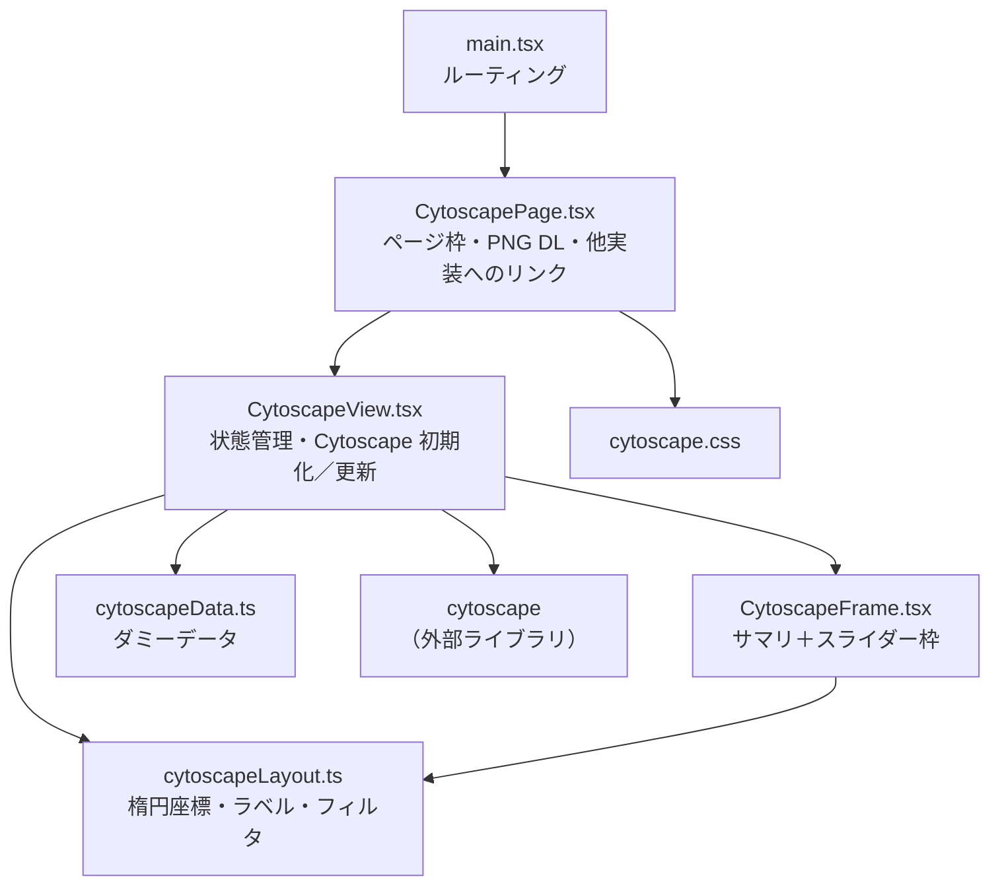
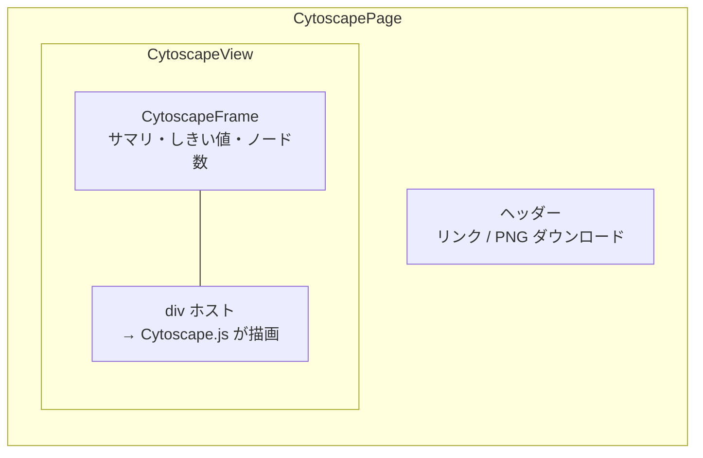
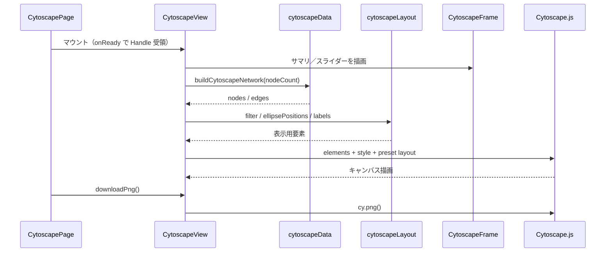

# コンポーネント構成図 — Cytoscape.js

提案用。実装フォルダ: [`src/transitionNetworkCytoscape/`](../src/transitionNetworkCytoscape/)（6 files）

ルート: `/transition-network/cytoscape`

## 全体構成

## 画面領域との対応

## データ・描画の流れ

## ファイル一覧

| ファイル | 役割 |
| --- | --- |
| `CytoscapePage.tsx` | ページ。ナビ、PNG ダウンロード（ライブラリ API） |
| `CytoscapeView.tsx` | Cytoscape インスタンスの生成・データ更新・PNG Handle |
| `CytoscapeFrame.tsx` | サマリ＋しきい値／ノード数スライダー枠 |
| `cytoscapeData.ts` | ノード／エッジのダミーデータ生成 |
| `cytoscapeLayout.ts` | 楕円座標・ラベル整形・エッジフィルタ |
| `cytoscape.css` | スタイル |

## 特徴（提案メモ）

- **無料**のグラフ可視化ライブラリ
- ノード／エッジをデータとして渡し、描画は Cytoscape に委譲
- スクラッチよりファイル数が少なく、グラフ操作（ズーム等）をライブラリに寄せやすい
- 楕円ノード内の細かい複数行レイアウトは、スクラッチほど自由ではない
