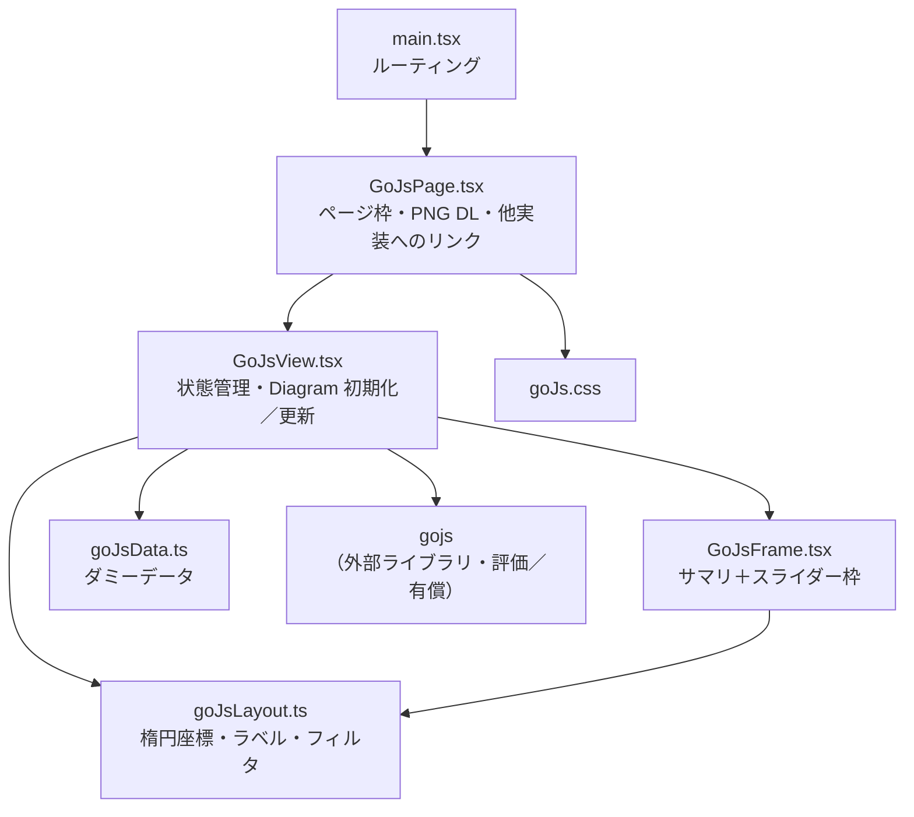
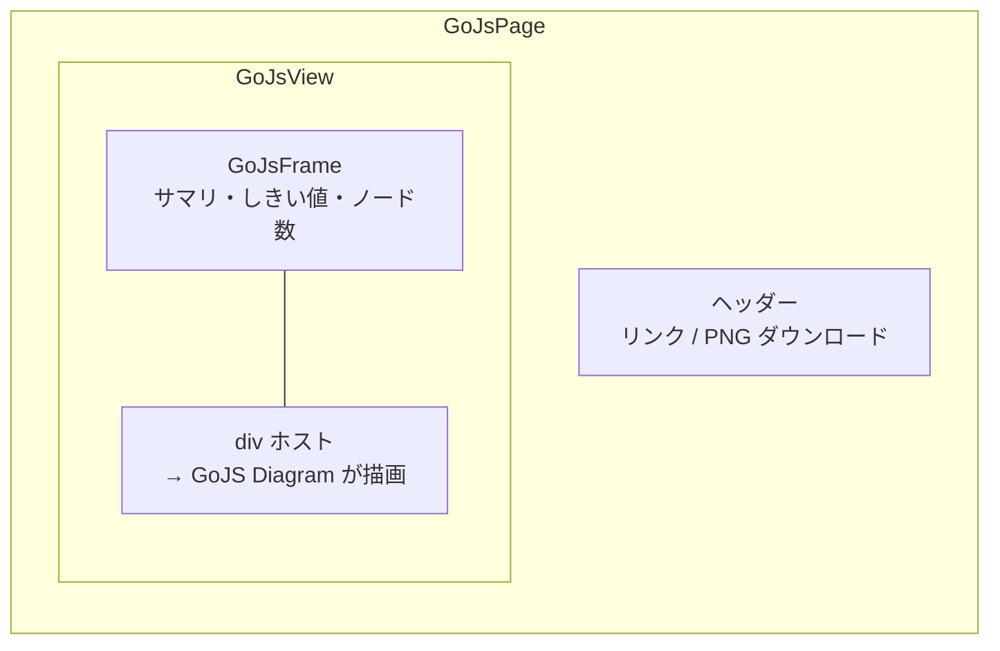
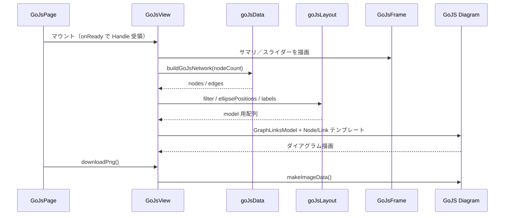

# コンポーネント構成図 — GoJS

提案用。実装フォルダ: [`src/transitionNetworkGoJs/`](../src/transitionNetworkGoJs/)（6 files）

ルート: `/transition-network/gojs`

## 全体構成

## 画面領域との対応

## データ・描画の流れ

## ファイル一覧

| ファイル | 役割 |
| --- | --- |
| `GoJsPage.tsx` | ページ。ナビ、PNG ダウンロード（ライブラリ API） |
| `GoJsView.tsx` | GoJS Diagram の生成・モデル更新・PNG Handle |
| `GoJsFrame.tsx` | サマリ＋しきい値／ノード数スライダー枠 |
| `goJsData.ts` | ノード／エッジのダミーデータ生成 |
| `goJsLayout.ts` | 楕円座標・ラベル整形・エッジフィルタ |
| `goJs.css` | スタイル |

## 特徴（提案メモ）

- **商用ダイアグラムライブラリ**（評価利用可、本番はライセンス必須）
- ノード／リンクをテンプレート＋データバインドで定義
- 構成は Cytoscape と同型（Page / View / Frame / Data / Layout / CSS）
- 評価版ではウォーターマークが出ることがある
