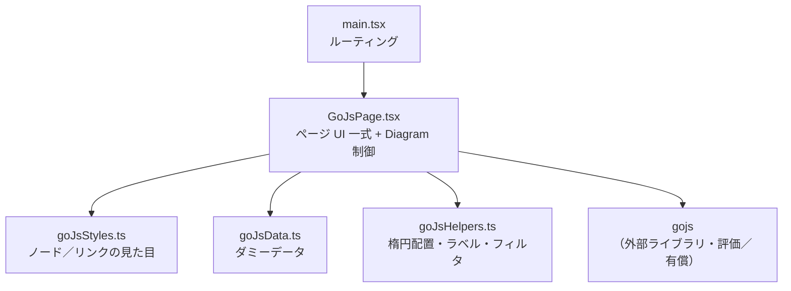
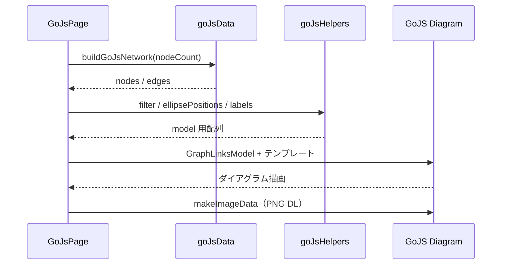

# コンポーネント構成図 — GoJS

提案用。実装フォルダ: [`src/transitionNetworkGoJs/`](../src/transitionNetworkGoJs/)（4 files）

- ルート: `/transition-network/gojs`
- 全体方針・画面レイアウト: [transition-network.md](./transition-network.md)
- 他実装: [スクラッチ](./component-scratch.md) / [Cytoscape](./component-cytoscape.md)

## 全体構成

## データ・描画の流れ

## ファイル一覧

| ファイル | 役割 |
| --- | --- |
| `GoJsPage.tsx` | ページ全体（ナビ、4領域 UI、Diagram 初期化／更新、ツールチップ、PNG） |
| `goJsStyles.ts` | ノード／リンク色・テンプレート定義 |
| `goJsData.ts` | ノード／エッジのダミーデータ生成 |
| `goJsHelpers.ts` | 楕円配置・ラベル整形・エッジフィルタ・圏外矢印・ツールチップ文言 |

## 特徴（提案メモ）

- **商用ダイアグラムライブラリ**（評価利用可、本番はライセンス必須）
- ノード／リンクをテンプレート＋データバインドで定義。ホバーは GoJS の `GraphObject.mouseEnter` / `mouseLeave`
- ノード数は試しで **最大 30**（楕円への可変配置）
- 圏外矢印は透明ゴーストノード＋リンクで表現（Cytoscape と同じ考え方）
- 評価版ではウォーターマークが出ることがある
