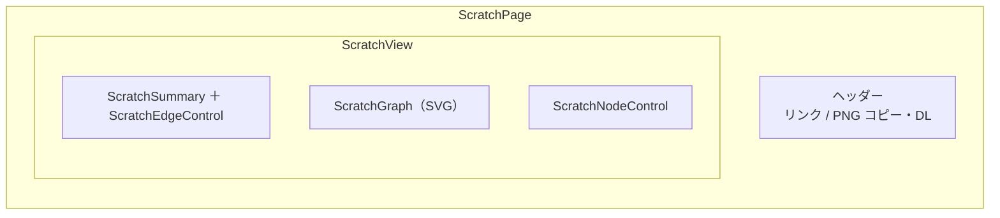
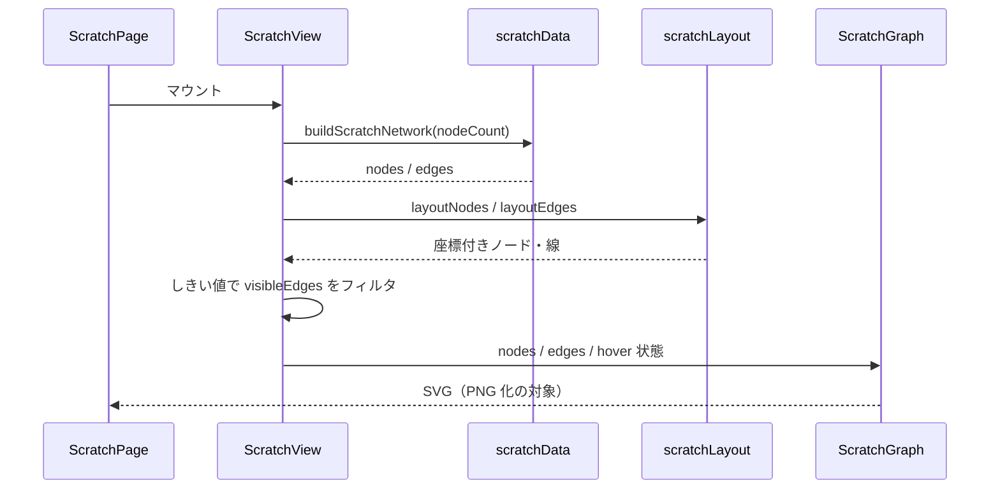

# コンポーネント構成図 — スクラッチ（React + SVG）

提案用。実装フォルダ: [`src/transitionNetworkScratch/`](../src/transitionNetworkScratch/)（10 files）

ルート: `/transition-network`

## 全体構成

```mermaid
flowchart TB
  main["main.tsx<br/>ルーティング"]
  page["ScratchPage.tsx<br/>ページ枠・PNG操作・他実装へのリンク"]
  view["ScratchView.tsx<br/>状態管理・組み立て"]
  summary["ScratchSummary.tsx<br/>左上サマリ"]
  edgeCtrl["ScratchEdgeControl.tsx<br/>右上: 表示最小値スライダー"]
  graph["ScratchGraph.tsx<br/>中央 SVG グラフ"]
  nodeCtrl["ScratchNodeControl.tsx<br/>下: ノード数スライダー"]
  data["scratchData.ts<br/>ダミーデータ"]
  layout["scratchLayout.ts<br/>楕円配置・エッジ幾何"]
  png["scratchPng.ts<br/>SVG → PNG"]
  css["scratch.css"]

  main --> page
  page --> view
  page --> png
  page --> css
  view --> summary
  view --> edgeCtrl
  view --> graph
  view --> nodeCtrl
  view --> data
  view --> layout
  graph --> layout
  edgeCtrl --> layout
  nodeCtrl --> data
```

## 画面領域との対応



## データ・描画の流れ



## ファイル一覧

| ファイル | 役割 |
| --- | --- |
| `ScratchPage.tsx` | ページ。ナビ、PNG コピー／ダウンロード |
| `ScratchView.tsx` | 状態（ノード数・しきい値・hover）と子コンポーネントの組み立て |
| `ScratchGraph.tsx` | 中央の有向ネットワーク（楕円ノード・遷移線・圏外矢印・ツールチップ） |
| `ScratchSummary.tsx` | 左上サマリ（集計項目・ベース金額） |
| `ScratchEdgeControl.tsx` | 右上スライダー（流入/流出線の表示最小値） |
| `ScratchNodeControl.tsx` | 下スライダー（ノード数） |
| `scratchData.ts` | ノード／エッジのダミーデータ生成 |
| `scratchLayout.ts` | 楕円配置・線の幾何・数値フォーマット |
| `scratchPng.ts` | SVG を PNG 化してコピー／保存 |
| `scratch.css` | スタイル |

## 特徴（提案メモ）

- **ライブラリなし**（React + SVG のみ）
- 見た目の再現度が最も高い（現行画面の基準実装）
- 描画・レイアウト・PNG まで自前のため、ファイル数は 3 案中最多
