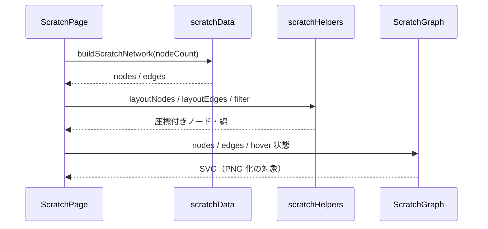

# コンポーネント構成図 — スクラッチ（React + SVG）

提案用。実装フォルダ: [`src/transitionNetworkScratch/`](../src/transitionNetworkScratch/)（6 files）

- ルート: `/transition-network`
- 全体方針・画面レイアウト: [transition-network.md](./transition-network.md)
- 他実装: [Cytoscape](./component-cytoscape.md) / [GoJS](./component-gojs.md)

## 全体構成

```mermaid
flowchart TB
  main["main.tsx<br/>ルーティング"]
  page["ScratchPage.tsx<br/>ページ UI 一式 + 状態管理"]
  graph["ScratchGraph.tsx<br/>中央 SVG グラフ"]
  styles["scratchStyles.ts<br/>SVG の色定数"]
  data["scratchData.ts<br/>ダミーデータ"]
  helpers["scratchHelpers.ts<br/>楕円配置・エッジ幾何"]
  png["scratchPng.ts<br/>SVG → PNG"]

  main --> page
  page --> graph
  page --> data
  page --> helpers
  page --> png
  graph --> helpers
  graph --> styles
```

## データ・描画の流れ



## ファイル一覧

| ファイル | 役割 |
| --- | --- |
| `ScratchPage.tsx` | ページ全体（ナビ、4領域 UI、状態、PNG コピー／DL） |
| `ScratchGraph.tsx` | 中央の有向ネットワーク（楕円ノード・遷移線・圏外矢印・ツールチップ） |
| `scratchStyles.ts` | SVG の色・グラデーション定数 |
| `scratchData.ts` | ノード／エッジのダミーデータ生成 |
| `scratchHelpers.ts` | 楕円配置・線の幾何・数値フォーマット |
| `scratchPng.ts` | SVG を PNG 化してコピー／保存 |

## 特徴（提案メモ）

- **ライブラリなし**（React + SVG のみ）
- 見た目の再現度が最も高い（現行画面の基準実装）
- グラフ本体のみ `ScratchGraph` として分離。PNG は自前（`scratchPng.ts`）
- ノード数は試しで **最大 30**（楕円への可変配置）
- ホバーは React の SVG マウスイベント（ライブラリ API ではない）
